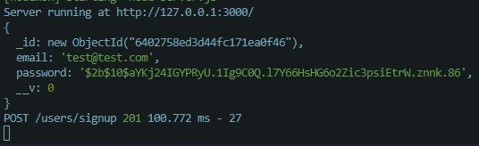

# Node.js RESTful API Project
This simple project is designed to provide endpoints for managing products, orders, and users. The API utilizes RESTful architecture and provides basic CRUD operations for each of these resources. With this API, you can easily create, read, update, and delete products, orders, and users.

The API is built using Node.js, a popular server-side JavaScript runtime environment, and the Express.js framework, which provides an easy-to-use interface for building web applications. In addition, the project utilizes MongoDB, a popular NoSQL database, for storing and managing data.

To get started with this project, simply clone the repository and run the necessary dependencies using npm. Once the server is up and running, you can start sending requests to the provided endpoints and interacting with the data. Please refer to the documentation for more detailed instructions on how to use the API.
___
## Getting started
1. Clone this repository.
2. Install the ***Requirements***.
3. Run the server using `npm start`.
4. Use an API client like Postman to send requests to `http://127.0.0.1:3000`.
___
## Requirements
run `sudo apt install npm`  
run `npm install --save express`
> Fast, unopinionated, minimalist web framework for Node.js.

run `npm install --save morgan`
> HTTP request logger middleware for node.js

run `npm install --save body-parser`  
> Node.js body parsing middleware. This will help parsing incoming request bodies in a middleware before your handlers, available under the req.body property.

run `npm install --save mongoose`  
> Mongoose is a MongoDB object modeling tool designed to work in an asynchronous environment.

run `npm install --save multer`  
> Multer is a node.js middleware for handling multipart/form-data, which is primarily used for uploading files.

run `npm install --save bcrypt`
>*This package will help to encrypt the password*
>
>

run `npm install --save jsonwebtoken`
>*This library will help handle the sign-in and token generation*

<br/>

## Env Varialbles
Create a file name: ***`nodemon.json`*** in the same directory

A JSON format should be inside the file, contains your environment passwords and keys:
```
{
    "env": {
        "MONGO_ATLAS_PW": "<Your MongoDB password here>",
        "JWT_KEY": "Your JsonWebToken key here!"
    }
}
```
___
## API Documentation
For detailed documentation on the API endpoints, please see the [API documentation](api-docs.md).
___
## Technologies Used
- Node.js
- Express
- MongoDB
___
## Author
Khoa Cao
______
### Nice to have
**nodemon**  
*nodemon will automatically restart the server if the code was changed*  

run `npm install --save-dev nodemon`  
> *This will not run with command `"nodemon server.js"` because it's not the global package installed on the machine, but it will run with the **scripts&rarr;start** in **package.json**.*
>```
>  "scripts": {
>    "start": "nodemon server.js"
>  },
>```
___
### How to make this better
- Some other rules might be added into User, such as roles, permission, relation to orders, etc...
