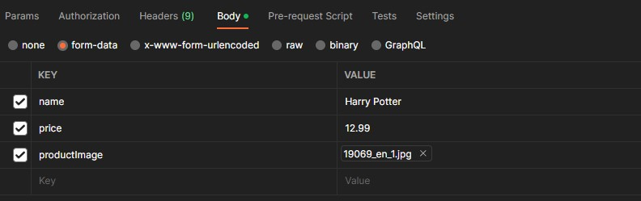

# API Documentation
This API provides access to a variety of resources, including users, products, and orders. The API is designed to be RESTful and provides basic CRUD operations for each of these resources.
___
## Authentication
Most endpoints require authentication via an API key, which must be provided in the request headers. To obtain an API key, user must login. A generated token will be provide as the response if the credential is valid.

In Hearders of the request, for **Authorization** value, add "Bearer " in front of the token.


___
## Base URL
The base URL for the API is: https://127.0.0.1:3000/
___
## <u>**Users**</u>

</br>

### POST /user/signup
Create a new user

**Request**
```
POST https://127.0.0.1:3000/user/signup
Content-Type: application/json

{
    "email": "test2@test.com",
    "password": "password1"
}
```
**Response**
```
Status: 201 Created
Content-Type: application/json

{
    "messaage": "User created"
}
```

</br>

### POST /user/login
Login the user and generate a token

**Request**
```
POST https://127.0.0.1:3000/user/login
Content-Type: application/json

{
    "email": "test@test.com",
    "password": "password"
}
```
**Response**
```
Status: 200 OK
Content-Type: application/json

{
    "message": "Authentication successful.",
    "token": "Generated Token",
    "request": [
        {
            "type": "DELETE",
            "description": "Delete this User",
            "url": "http://127.0.0.1:3000/user/userID"
        }
    ]
}
```

</br>

### DELETE /user/:userID
Delete a user by their ID. User's Token will be required to place in header of the request.

**Request Parameters**
| Parameter | Type   | Required | Description                              |
| --------- | ------ | -------- | ---------------------------------------- |
| `userID`  | string | yes      | The unique identifier of the user to retrieve. |

**Request**
```
DELETE https://127.0.0.1:3000/user/userID
Authorization: Bearer <token>
```
**Response**
```
Status: 200 OK
Content-Type: application/json

{
    "message": "User is deleted"
}
```
___
## <u>**Products**</u>

</br>

### GET /products
Get all the products in database

**Request**
```
GET https://127.0.0.1:3000/products
Content-Type: application/json

```
**Response**
```
Status: 200 OK
Content-Type: application/json

{
    "count": 5,
    "products": [
        {
            "name": "Harry Potter 2",
            "price": 12.99,
            "productImage": "uploads/2023-03-06T21:06:32.609Z19069_en_1.jpg",
            "_id": "productID",
            "request": [
                {
                    "type": "GET",
                    "description": "Get product's info",
                    "url": "http://127.0.0.1:3000/products/productID"
                },
                {
                    "type": "DELETE",
                    "description": "Delete this product",
                    "url": "http://127.0.0.1:3000/products/productID"
                }
            ]
        },
        ...
    ]
}
```

</br>

### GET /products/:productID
Retrive a product by their ID.

**Request Parameters**

| Parameter | Type   | Required | Description                              |
| --------- | ------ | -------- | ---------------------------------------- |
| `productID`  | string | yes      | The unique identifier of the product to retrieve. |

**Request**
```
GET https://127.0.0.1:3000/products/productID
```
**Response**
```
Status: 200 OK
Content-Type: application/json

{
    "product": {
        "_id": "productID",
        "name": "Harry Potter 2",
        "price": 12.99,
        "productImage": "uploads/2023-03-06T21:06:32.609Z19069_en_1.jpg"
    },
    "request": {
        "type": "GET",
        "description": "Get all products",
        "url": "http://127.0.0.1:3000/products/"
    }
}
```

</br>

### POST /products
Create a new product

**Request**
```
POST https://127.0.0.1:3000/products
Content-Type: multipart/form-data
Authorization: Bearer <token>

body: see the example picture below
```


**Response**
```
Status: 201 Created
Content-Type: application/json

{
    "message": "Created product successfully!",
    "createProduct": {
        "name": "Harry Potter",
        "price": 12.99,
        "_id": "productID",
        "request": {
            "type": "GET",
            "url": "http://127.0.0.1:3000/products/productID"
        }
    }
}
```

</br>

### PATCH /products/:productID
Update a product by their ID. User's Token will be required to place in header of the request.

**Request Parameters**
| Parameter | Type   | Required | Description                              |
| --------- | ------ | -------- | ---------------------------------------- |
| `productID`  | string | yes      | The unique identifier of the product to retrieve. |

**Request**
```
PATCH https://127.0.0.1:3000/products/productID
Content-Type: application/json
Authorization: Bearer <token>

[
    {
        "propName": "price",
        "value": "4.99"
    }
]
```
**Response**
```
Status: 200 OK
Content-Type: application/json

{
    "message": "Product is updated",
    "request": {
        "type": "GET",
        "url": "http://127.0.0.1:3000/products/productID"
    }
}
```

</br>

### DELETE /products/:productID
Delete a product by their ID. User's Token will be required to place in header of the request.

**Request Parameters**
| Parameter | Type   | Required | Description                              |
| --------- | ------ | -------- | ---------------------------------------- |
| `productID`  | string | yes      | The unique identifier of the product to retrieve. |

**Request**
```
DELETE https://127.0.0.1:3000/products/productID
Authorization: Bearer <token>
```
**Response**
```
Status: 200 OK
Content-Type: application/json

{
    "message": "Product is deleted",
    "request": {
        "type": "GET",
        "description": "Get all products",
        "url": "http://127.0.0.1:3000/products/"
    }
}
```
___
## **Orders**

</br>

### GET /orders
Get all the orders in database. User's Token will be required to place in header of the request.

**Request**
```
GET https://127.0.0.1:3000/orders
Content-Type: application/json
Authorization: Bearer <token>
```
**Response**
```
Status: 200 OK
Content-Type: application/json

{
    "count": 2,
    "orders": [
        {
            "_id": "orderID",
            "product": {
                "_id": "productID",
                "name": "Music Book 2"
            },
            "quantity": 2,
            "request": {
                "type": "GET",
                "description": "Get order's info",
                "url": "http://127.0.0.1:3000/orders/orderID"
            }
        },
        ...
    ]
}
```

</br>

### GET /orders/:orderID
Retrive a order by their ID. User's Token will be required to place in header of the request.

**Request Parameters**
| Parameter | Type   | Required | Description                              |
| --------- | ------ | -------- | ---------------------------------------- |
| `orderID`  | string | yes      | The unique identifier of the product to retrieve. |

**Request**
```
GET https://127.0.0.1:3000/products/orderID
Authorization: Bearer <token>
```
**Response**
```
Status: 200 OK
Content-Type: application/json

{
    "order": {
        "_id": "orderID",
        "product": {
            "_id": "productID",
            "name": "Music Book 2"
        },
        "quantity": 2,
        "__v": 0
    },
    "request": [
        {
            "type": "GET",
            "description": "Get all orders",
            "url": "http://127.0.0.1:3000/orders/"
        },
        {
            "type": "DELETE",
            "description": "Delete this order",
            "url": "http://127.0.0.1:3000/orders/orderID"
        }
    ]
}
```

</br>

### POST /orders
Create a new order

**Request**
```
POST https://127.0.0.1:3000/orders
Content-Type: multipart/form-data
Authorization: Bearer <token>

{
    "quantity": "3",
    "productID": "productID"
}
```
**Response**
```
Status: 201 Created
Content-Type: application/json

{
    "message": "Order stored",
    "createdOrder": {
        "_id": "orderID",
        "product": "productID",
        "quantity": 3
    },
    "request": {
        "type": "GET",
        "url": "http://127.0.0.1:3000/orders/orderID"
    }
}
```

</br>

### DELETE /orders/:orderID
Delete a order by their ID. User's Token will be required to place in header of the request.

**Request Parameters**
| Parameter | Type   | Required | Description                              |
| --------- | ------ | -------- | ---------------------------------------- |
| `orderID`  | string | yes      | The unique identifier of the order to retrieve. |

**Request**
```
DELETE https://127.0.0.1:3000/products/orderID
Authorization: Bearer <token>
```
**Response**
```
Status: 200 OK
Content-Type: application/json

{
    "message": "Order is deleted",
    "request": [
        {
            "type": "GET",
            "description": "Get all Orders",
            "url": "http://127.0.0.1:3000/orders/"
        },
        {
            "type": "POST",
            "description": "Create new Order",
            "url": "http://127.0.0.1:3000/orders/",
            "body": {
                "productID": "ID",
                "quantity": "Number"
            }
        }
    ]
}
```
